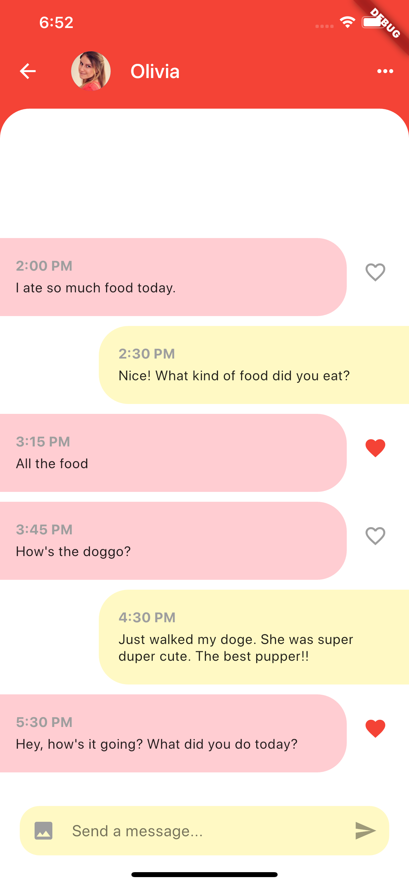
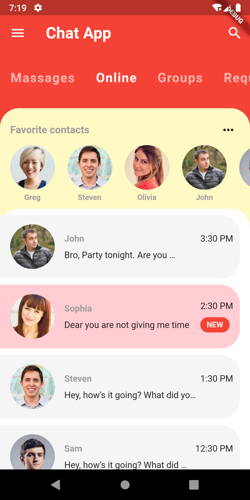
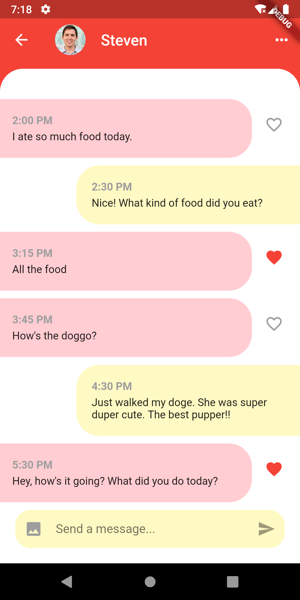

# chatapp

A Chatting Flutter application with beautiful UI and loading animation.

## App architecture by using state_rebuilder
**- domain**  
    |        | **- entities :** (mutable objects with unique IDs.  
    |        |              They are the in-memory representation of   
    |        |              the data that was retrieved from the persistence   
    |        |              store (data_source))  
    |        |   
    |        | **- value objects :** (immutable objects which have value equality   
    |        |                      and self-validation but no IDs)  
    |        |   
    |        | **- exceptions :** (all custom exceptions classes that can be   
    |        |                      thrown from the domain)  
    |        |  
    |        | **- common :** (common utilities shared inside the domain)  
    |   
    | **- service**  
    |        | **- interfaces :** (interfaces that should any external service implements)  
    |        |   
    |        | **- exceptions :** (all custom exceptions classes that can be thrown   
    |        |                    from the service, infrastructure and data_source)  
    |        |   
    |        | **- common :**(common utilities shared inside the service)   
    |        |   
    |        | **- use case classes  
    |  
    | **-data_source** : (implements interfaces and throws exception defined in   
    |        |                the service layer. It is used to fetch and persist data  
    |        |                and instantiate entities and value objects)  
    |         
    | **UI**  
    |        | **- pages** :(collection of pages the UI has).  
    |        |   
    |        | **- widgets**: (small and reusable widgets that should be app independent. 
    |        |                 If you use a widget from external libraries, put it in this folder
    |        |                 and adapt its interface, 
    |        |   
    |        | **- exceptions :** (Handle exceptions)  
    |        |   
    |        | **- common :**(common utilities shared inside the ui)  
    
Build above architecture by using state_rebuilder state management.\n
I found state_rebuilder is very powerful state management solution. 
1. Very less boilerplate(No boilerplate we can say), as compare to MobX and BLoC \n 
2. pure dart code \n
3. Easy to understand and implement \n
\n
You can get the detail below
- [state_rebuilder](https://flutter.dev/docs/get-started/codelab)

\n
App design is inspired by
- [Design Link](https://dribbble.com/shots/6428387-Messenger-Mobile-Concept)

## App Screenshot (iOS)

  
  

## App Screenshot (Android)

  
  

